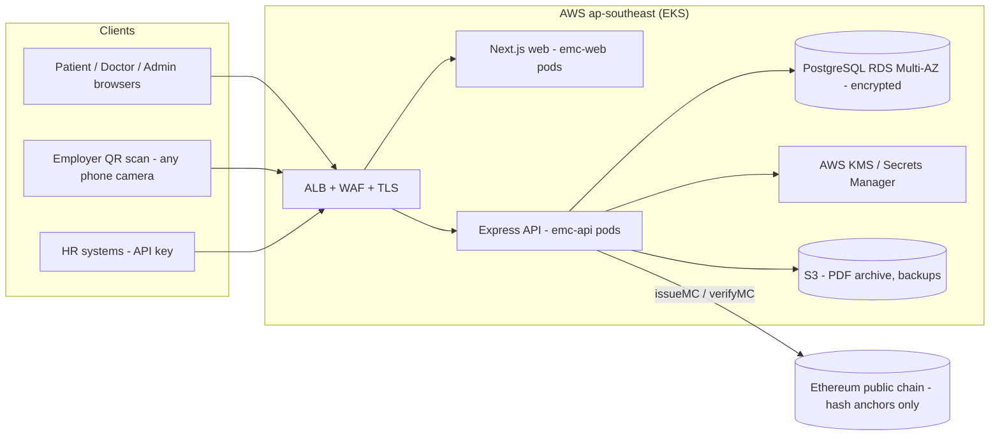

# System & Security Architecture

## System overview

Three trust layers, each independently checkable:

1. **Registry** (PostgreSQL): the encrypted system of record. PII is AES-256-GCM
   encrypted per field; IC lookups use keyed HMAC digests so plaintext is never indexed.
2. **PKI**: each doctor gets an Ed25519 keypair at registration. The private key is
   encrypted at rest (KMS-wrapped in production) and every MC is signed with it.
3. **Blockchain**: the canonical keccak-256 fingerprint of each MC is anchored
   on a public chain at issuance. The chain stores 32 bytes per MC — never patient data.

A verifier needs all three to agree: record intact (hash recomputes), signature valid
(doctor authentic), anchor present (timestamp immutable). Forging an MC requires
breaking keccak-256, stealing a KMS-wrapped signing key, **and** rewriting a public
blockchain — simultaneously.

## Security architecture

| Layer | Control |
|---|---|
| Transport | TLS 1.2+ at ALB, HSTS, security headers (helmet / Next headers) |
| Authentication | JWT access (15 min) + rotating refresh tokens (hashed at rest), TOTP 2FA, account lockout after 5 failures |
| Authorization | RBAC middleware (7 roles), state-scoping for state admins, facility-scoping for facility admins, resource-ownership checks on every MC operation |
| Data at rest | RDS encryption + field-level AES-256-GCM for IC & diagnosis; HMAC-SHA256 search digests |
| Integrity | keccak-256 canonical hash, Ed25519 signatures, blockchain anchor, hash-chained audit log with `GET /admin/audit/integrity` verification |
| Abuse prevention | Per-route rate limits (auth 20/15min, verify 120/15min), zod validation on every body, Prisma parameterized queries (no SQL injection surface), 256 KB body limit |
| Fraud detection | Rules engine: duplicate rest periods, volume anomalies, suspended facility/doctor, hash mismatch (tampering), login geo anomalies |
| Monitoring | Every login, issuance, verification, download and admin action is audit-logged with IP + user agent |

### Threat model highlights

- **Malicious insider with DB access**: can edit a row, but verification recomputes
  the hash → TAMPERED + CRITICAL fraud alert. Cannot forge signatures (keys are
  KMS-wrapped) or rewrite the chain.
- **Stolen doctor password**: 2FA blocks; if bypassed, volume anomaly + geo anomaly
  rules flag the account, and every issued MC is attributable and revocable.
- **Platform operator compromise**: the blockchain anchor is the backstop — issuance
  timestamps cannot be backdated even by root.

## Scalability path (10M users / 100k concurrent)

- Stateless API pods behind HPA (3→30 replicas, CPU-targeted) — session state lives
  in JWTs and the DB, so horizontal scaling is linear.
- PostgreSQL: RDS Multi-AZ with read replicas; verification reads (the hot path)
  are single-index lookups by `canonicalHash` and can move to replicas.
- Verification responses are cacheable for seconds at the CDN for burst absorption.
- Chain writes are asynchronous-tolerant: anchoring can be queued (SQS) at national
  scale without blocking issuance UX.
- 99.99% uptime: Multi-AZ RDS, ≥3 replicas per service across AZs, ALB health checks,
  zero-downtime rolling deploys.

## Integration readiness

Deliberate seams for national systems (each is one adapter module):

- **MyDigital ID**: `authService.login` accepts pluggable identity providers — OIDC
  federation slots in front of the local password path.
- **MMC doctor registry**: `facilities.ts → POST /doctors` has the validation point
  where the MMC number is checked against the live register.
- **MySejahtera / KKM systems**: REST API is versioned (`/api/v1`) with API-key
  auth already implemented for machine-to-machine (employer bulk verify shows the pattern).
