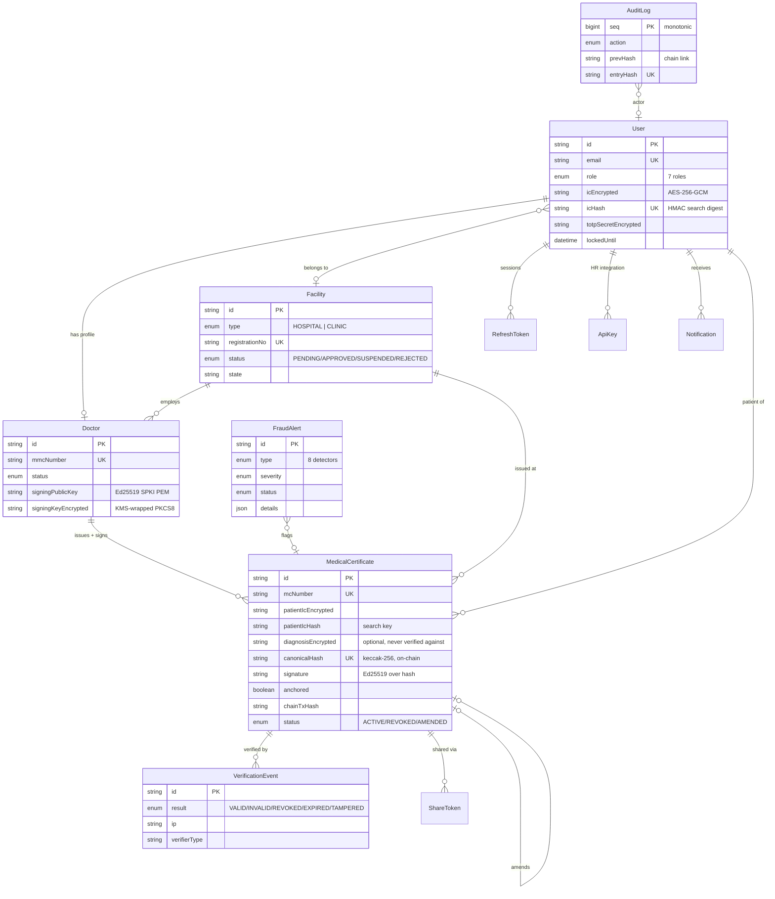

# Database Schema & ER Diagram

PostgreSQL via Prisma. Source of truth: [`api/prisma/schema.prisma`](../api/prisma/schema.prisma).

## ER diagram



## Design decisions

- **PII encryption**: `icEncrypted` / `diagnosisEncrypted` are AES-256-GCM with a
  KMS-managed key; `icHash`/`patientIcHash` are HMAC-SHA256 digests enabling exact
  search without a plaintext index. Dumping the DB yields no usable identities.
- **Diagnosis is quarantined**: optional, encrypted, excluded from the canonical hash,
  and structurally absent from all verification responses.
- **`canonicalHash` is the public identity** of an MC. It is what the QR encodes,
  what the chain stores, and what employers query. Unique index makes verification a
  single lookup.
- **Amendments preserve history**: an amended MC keeps its row and chain anchor;
  the replacement links back via `amendedFromId`. Verifying the old hash reports the
  supersession.
- **Audit log is append-only + hash-chained**: `entryHash = SHA-256(prevHash | actor |
  action | entity | meta | timestamp)`. A single UPDATE or DELETE anywhere in history
  breaks the chain, detectable via the integrity endpoint.
- **Walk-in patients**: MCs reference the patient by IC digest, not by account.
  When the patient later registers, `patientUserId` back-links automatically.

## Migrations

```bash
cd platform/api
npx prisma migrate dev      # development
npx prisma migrate deploy   # CI / production
```
