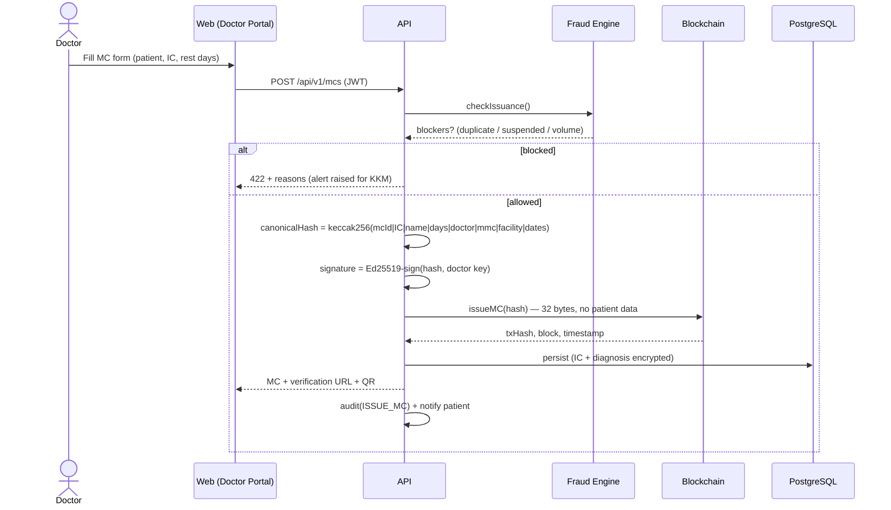
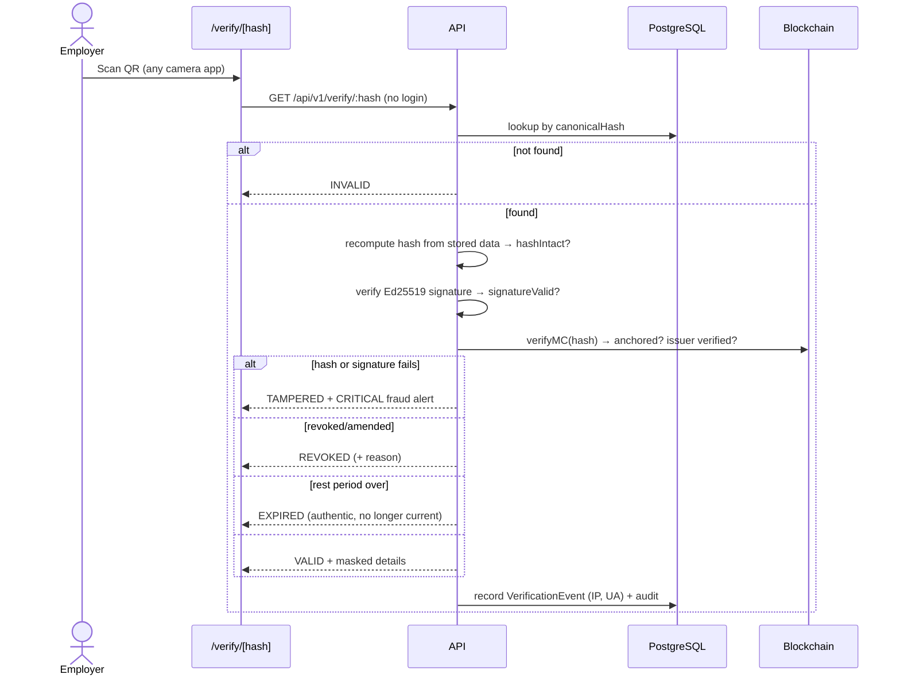

# Workflows & User Journeys

## Issuance (blockchain workflow)

Canonical hash formula (**frozen — compatible with the live prototype contract**):
`mcId|patientIC|patientName|duration|doctorName|mmcNumber|hospital|dateIssued|startDate|endDate`
→ `keccak256(utf8)`. Diagnosis is deliberately excluded.

## Verification (QR workflow)

Offline verification mode: the QR contains the full verification URL including the
hash. Where connectivity is absent, the hash itself + the printed fingerprint allow
delayed verification; a signed offline bundle (public keys + revocation list snapshot)
is the documented extension point.

## Fraud detection matrix

| Signal | Rule | Action |
|---|---|---|
| Duplicate MC | ACTIVE MC for the same IC digest with overlapping rest period | **Block** + HIGH alert |
| Edited record / PDF | Recomputed hash ≠ stored hash, or signature fails | TAMPERED verdict + **CRITICAL** alert |
| Suspended clinic | Facility not APPROVED at issuance | **Block** + CRITICAL alert |
| Inactive doctor | Doctor not ACTIVE | **Block** + HIGH alert |
| Impossible volume | > 60 MCs/doctor/day → MEDIUM alert; > 180 → **block** + CRITICAL |
| Geo anomaly | Login from a different country within 6 h | HIGH alert |
| Fake MMC | Unique-MMC constraint + registry validation point at doctor registration | Reject |
| Brute force | 5 failed logins → 15-min lockout; per-route rate limits | Lock + audit |

## User journeys

**Patient**: register with IC → MCs issued to that IC (even before registration)
appear automatically → download official PDF → share verification link with employer
→ notified on issuance/revocation.

**Doctor**: provisioned by facility admin (keypair generated) → logs in (2FA) →
issues MC in one form → MC is signed + anchored in seconds → can revoke or amend
with an audited reason.

**Employer**: scans QR — no account needed for a single check → registers for the
portal to keep a verification history → creates API keys to bulk-verify from the HR
system.

**Clinic/Hospital admin**: facility approved by KKM → registers doctors against MMC
numbers → monitors per-doctor issuance → suspends/reinstates issuing privileges.

**State admin**: sees analytics, facilities and fraud alerts scoped to their state.

**KKM (super admin)**: national analytics with state heatmap data → approves/suspends
facilities → works the fraud-alert queue → audits everything, including the audit
log's own integrity.
